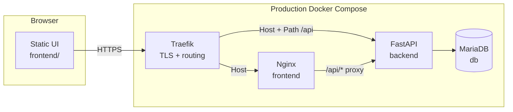

# CSS360 Car Flip

Web application for analyzing car flips: static frontend, FastAPI API, MariaDB in Docker, and in production TLS plus routing through Traefik.

## Table of contents

1. [Architecture](#architecture)
2. [Resale pricing model](#resale-pricing-model)
3. [Configuration](#configuration)
4. [Demo catalog and seeds](#demo-catalog-and-seeds)
5. [Local development](#local-development)
6. [CI/CD](#cicd)
7. [Git hooks (pre-commit)](#git-hooks-pre-commit)
8. [Repository guidelines](#repository-guidelines)
9. [Reference: backend layout and API](#reference-backend-layout-and-api)

---

## Architecture

### Overview



| Layer | Technology | Purpose |
|-------|------------|---------|
| **Frontend** | Nginx + static HTML/CSS/JS | Inventory dashboard, filters, login |
| **Backend** | FastAPI (Python 3.11) | REST API, sessions, OAuth, business logic |
| **Database** | MariaDB 10.11 | Users, cars, and related tables |
| **Proxy (prod)** | Traefik | HTTPS, `Host(APP_PUBLIC_HOST)`, strips `/api` prefix for backend |
| **Proxy (local)** | `docker-compose.override.yml` | Publishes ports `8080` / `8000` without Traefik |

Compose is defined in [docker-compose.yml](docker-compose.yml). The internal network `css360_internal` provides DNS between services (`backend`, `db`, `frontend`); the external network `proxy_network` is used by Traefik and for parity with the production stack.

### Request flow

- **Production:** browser → Traefik → paths `/api/*` go to the backend (`StripPrefix(/api)` middleware); everything else goes to Nginx serving static files.
- **Local:** browser → Nginx on `:8080` → `location /api/` proxies to `backend:8000` with the same strip-prefix semantics ([frontend/nginx.conf](frontend/nginx.conf)).

API routes are registered both with and without the `/api` prefix ([backend/app/main.py](backend/app/main.py)) so one codebase works behind Traefik and behind local Nginx.

### Database

- Compose service `db` uses image `mariadb:10.11`; data lives in the named volume `mariadb_data` (survives container restarts).
- Backend connection is configured via `DB_*` or `DATABASE_URL` ([backend/app/config.py](backend/app/config.py)).
- On backend container start, `alembic upgrade head` runs ([backend/entrypoint.sh](backend/entrypoint.sh)).
- Core entity: `cars` table plus satellite tables (location, media, aspects, listing terms, etc.) — see [backend/app/models/](backend/app/models/).
- SSO users are stored in `users` ([backend/app/models/user.py](backend/app/models/user.py)).

Migrations live under [backend/alembic/versions/](backend/alembic/versions/).

### Authentication

**Production** — Microsoft Entra ID (OAuth 2.0 / OpenID Connect):

1. `GET /api/auth/login` — redirect to `login.microsoftonline.com`.
2. `GET /api/auth/callback` — exchange code for tokens, validate `id_token`, upsert user by Azure OID.
3. Session in a signed cookie (`SessionMiddleware`, secret `AUTH_SESSION_SECRET`).
4. Optional `ALLOWED_EMAIL_DOMAIN` — only allow emails like `*@<domain>`.
5. `GET /api/auth/me`, `POST /api/auth/logout` — session check and sign-out.

Implementation: [backend/app/api/routes/auth.py](backend/app/api/routes/auth.py), [backend/app/services/microsoft_oidc.py](backend/app/services/microsoft_oidc.py).

**Local development** — fake sign-in runs only when `APP_ENV` is not production, `DEV_AUTH_BYPASS=true`, and all four `AZURE_AD_*` login variables are **unset or empty**. If Entra is configured locally, `/api/auth/login` uses real Microsoft sign-in (name and profile photo from the id token). In production the bypass is **hard-disabled**. See [local development](#local-development).

### Backend (layers)

| Path | Role |
|------|------|
| [backend/app/main.py](backend/app/main.py) | FastAPI app, CORS, sessions, routers |
| [backend/app/config.py](backend/app/config.py) | Environment variables |
| [backend/app/db.py](backend/app/db.py) | SQLAlchemy engine and sessions |
| [backend/app/api/routes/](backend/app/api/routes/) | HTTP: `/cars`, `/health`, `/auth/*` |
| [backend/app/repositories/](backend/app/repositories/) | Database queries |
| [backend/app/services/](backend/app/services/) | ROI, resale pricing, geo, body style, OIDC |
| [backend/app/services/pricing/](backend/app/services/pricing/) | Cascading ARV estimator (comps → segment → heuristic) |
| [backend/app/integrations/ebay/](backend/app/integrations/ebay/) | eBay Browse API ingest |
| [backend/app/services/ebay_sync.py](backend/app/services/ebay_sync.py) | Upsert eBay listings into MySQL (`sync_ebay=1` on `/cars`) |

### Frontend

Static assets under [frontend/](frontend/):

| Path | Contents |
|------|----------|
| [frontend/pages/](frontend/pages/) | HTML pages (`index.html`, `login.html`, `car.html`, …) — served at short URLs via nginx rewrite |
| [frontend/js/](frontend/js/) | Application scripts (`script.js`, `app-shell.js`, `listing-shared.js`, …) |
| [frontend/css/](frontend/css/) | Stylesheets; entry point [frontend/css/styles.css](frontend/css/styles.css) |
| [frontend/icons/](frontend/icons/) | SVG icons (MIT, Heroicons) |

Nginx maps `/index.html` → `/pages/index.html` so public URLs stay unchanged.

---

## Resale pricing model

The app estimates **after-repair value (ARV)** — expected resale price after reconditioning — separately from **repair cost**. **ROI** and **net profit** are computed at read time from purchase price, `resale_value`, and `repair_cost` ([backend/app/services/flip.py](backend/app/services/flip.py)).

Resale ARV is produced by a **cascading hybrid estimator** in [backend/app/services/pricing/](backend/app/services/pricing/). Results are stored on each `cars` row (`resale_value`, `resale_method`, `resale_confidence`, `resale_comp_count`, `resale_segment_key`, `resale_estimated_at`) and refreshed on eBay upsert, on `GET /api/cars` (page slice, DB-only), and via `POST /api/cars/{id}/resale-refresh`.

### Cascade order

`ResalePricingService` tries providers in this order:

1. **Internal comps** — similar listings already in our MySQL inventory  
2. **Segment baseline** — median price for `brand|model|year` from `vehicle_price_segments`  
3. **Heuristic** — rule-based economics from listing attributes (legacy flip model)  
4. **External APIs** — stub for future third-party pricing (`ExternalPricingProvider` returns `None` today)

The first provider that meets its **acceptance threshold** wins. If none qualify, the service returns the best **fallback** estimate (usually heuristic).

Default thresholds ([backend/app/services/pricing/service.py](backend/app/services/pricing/service.py)):

| Provider | Accept when |
|----------|-------------|
| Comps | `method` starts with `comps` **and** `confidence ≥ 0.45` |
| Segment | `method == segment` **and** `confidence ≥ 0.35` |
| Heuristic | Used as final fallback |

### Level 1: Internal comps

[InternalCompsProvider](backend/app/services/pricing/providers.py) searches up to 20 comparable cars in the DB ([comparable_finder.py](backend/app/services/pricing/comparable_finder.py)), scoring similarity from make/model, year, mileage, condition, title, region, and recency.

- Returns **`None`** if fewer than **2** comps are found, or if a weighted trimmed median cannot be computed.
- Otherwise builds ARV from the median comp price plus adjustments (mileage delta, condition, title, trim/engine mismatch, listing-format haircut, fees).
- Method label: `comps_tight` (≥ 5 high-similarity comps) or `comps_shrunk` (broader comp set).
- Confidence blends comp count, average similarity, and recency (typically **0.45–0.9** when comps are usable).

If comps exist but **confidence &lt; 0.45**, the estimate is **not** accepted; the cascade continues to segment.

### Level 2: Segment baseline

[SegmentBaselineProvider](backend/app/services/pricing/providers.py) reads pre-aggregated rows in `vehicle_price_segments` (rebuilt periodically from inventory — see `_maybe_refresh_segment_baselines` in [ebay_sync.py](backend/app/services/ebay_sync.py)).

- Returns **`None`** if no segment exists for the listing’s brand/model/year (including adjacent year buckets), or if the segment has **&lt; 2** priced samples.
- ARV = segment median plus the same style of mileage/condition/title/format adjustments.
- Segment confidence is derived from sample count and is **always ≥ 0.35** when a segment row is returned, so any valid segment normally passes the segment threshold.

Typical case: comps are weak (wrong region/year) but several same-model cars exist in inventory → **segment** wins instead of heuristic.

### Level 3: Heuristic fallback

[HeuristicProvider](backend/app/services/pricing/providers.py) calls `estimate_flip_economics` — year, mileage, condition, vehicle title, listing format, and purchase price. Fixed **confidence = 0.28** (UI: **Low**).

Heuristic is chosen when:

- **No comps path:** fewer than 2 similar listings in the DB, or comps confidence below 0.45 **and** no qualifying segment.
- **No segment path:** exotic or sparse brand/model/year (e.g. only one car in that bucket), or segments not rebuilt yet.
- **Weak comps discarded:** if segment is unavailable, a low-confidence comp estimate is **not** kept — `HeuristicProvider` overwrites the fallback at the end of the loop.

Comparable prices in comps/segment reflect **eBay asking prices** in our database, not verified sold prices.

### Repair cost

Repair is still estimated by [estimate_flip_from_listing](backend/app/services/flip.py) at ingest time (independent of the ARV cascade). ROI uses both numbers together.

### Confidence in the UI

Stored `resale_confidence` (0–1) is mapped to labels in [frontend/js/listing-shared.js](frontend/js/listing-shared.js):

| UI label | `resale_confidence` |
|----------|---------------------|
| **High** | ≥ 0.75 |
| **Medium** | ≥ 0.45 |
| **Low** | &lt; 0.45 |

Inventory cards show method and confidence under ROI; the car detail page explains the source (comps / segment / heuristic) and shows a confidence pill with a hover tooltip.

### Maintenance

- **Backfill existing rows:** `docker compose exec backend python scripts/backfill_resale_estimates.py` (or run the same path from `backend/` with env loaded).
- **Tests:** [backend/tests/test_resale_pricing.py](backend/tests/test_resale_pricing.py).

---

## Configuration

Secrets are **never committed**. For a local machine, copy [.env.example](.env.example) to `.env` (listed in `.gitignore`).

### Environment variables (no secret values)

| Variable | Purpose |
|----------|---------|
| `APP_ENV` | `development` or `production` — app mode and auth checks |
| `DB_HOST`, `DB_PORT`, `DB_NAME`, `DB_USER`, `DB_PASSWORD` | MariaDB connection |
| `MYSQL_ROOT_PASSWORD` | Root password for the `db` container |
| `DEV_AUTH_BYPASS`, `DEV_AUTH_EMAIL` | Non-prod only: fake sign-in when `AZURE_AD_*` is not configured |
| `SEED_ON_START`, `PURGE_DEMO_ON_START` | Run seed / demo purge on container start |
| `SEED_WRITE_DEMO_TO_DB` | Explicit write of demo rows to MySQL (see [seeds](#demo-catalog-and-seeds)) |
| `DEMO_IN_MEMORY_WHEN_EMPTY`, `DEMO_SEED_COUNT` | In-memory catalog when `cars` is empty |
| `AZURE_AD_TENANT_ID`, `AZURE_AD_CLIENT_ID`, `AZURE_AD_CLIENT_SECRET` | Entra ID (prod / optional local) |
| `AZURE_AD_REDIRECT_URI` | Must **exactly** match the URI in the Entra app registration |
| `AUTH_SESSION_SECRET` | Session cookie signing |
| `ALLOWED_EMAIL_DOMAIN` | Optional email domain restriction |
| `APP_PUBLIC_HOST` | Hostname for Traefik (no scheme), e.g. `app.example.com` |
| `CORS_ORIGINS` | Required in prod: comma-separated browser origins |
| `EBAY_CLIENT_ID`, `EBAY_CLIENT_SECRET`, `EBAY_SANDBOX` | eBay ingest when UI sends `sync_ebay=true` (first load, Search) |
| `EBAY_BATCH_SIZE`, `EBAY_WAVE_SIZE` | Staged eBay ingest: search pool size (default 150) and getItem wave (default 50, matches page size) |
| `EBAY_DEFAULT_QUERY` | Default eBay search when the UI has no text query (default `car`) |
| `EBAY_CATEGORY_IDS` | eBay category filter (default `6001` = Cars & Trucks) |
| `EBAY_SEARCH_LIMIT` | Max search hits per Browse page (default `50`) |
| `EBAY_GET_ITEM_MAX` | How many hits to enrich via `getItem` (default `12`; `0` = search only) |
| `EBAY_SYNC_MIN_INTERVAL_SEC` | Per-user cooldown between `sync_ebay=1` calls (default `10`; `0` disables) |

Clear all inventory in MySQL (cars + external sellers):

```bash
docker compose exec backend python -m app.purge_inventory
```

One-time on container start: `PURGE_INVENTORY_ON_START=true` in `.env`.

| `INVENTORY_MODE` | `auto` (default), `ebay_only` (no demo fallback), `demo_only` |
| `DEMO_IN_MEMORY_WHEN_EMPTY` | In `auto` mode: demo when DB empty and eBay empty/unconfigured |

`SEED_ON_START=false` only skips writing demo rows **into MySQL**. **`GET /api/cars` always reads from MySQL**; use `sync_ebay=true` to pull fresh listings from eBay (deduped by `external_listing_id`). Filter-only actions do not call eBay.

`SEED_ON_START=false` with empty DB: inventory is empty until the first `sync_ebay` (page load triggers one). Legacy in-memory demo applies only to `/cars/meta` bounds when eBay is unconfigured.

`sync_ebay=true` runs only on **first page load** and **Search** (not on Apply filters). Sidebar filters query the database only.

`GET /api/cars` includes `data_mode`: `ebay_refreshed` after a successful sync, or `database` when serving cached rows (sync off, eBay failure, or cooldown fallback). The UI shows **(Database mode)** in the results hint when `data_mode` is `database`.

If eBay sync fails (network/token/commit), the API still returns **200** with DB listings and `data_mode: database` (except **429** cooldown, which the UI retries without `sync_ebay`).

Optional **Settings** (`settings.html`, `localStorage`) enables a **View raw JSON** button in the listing modal (`GET /api/cars/{id}/raw-listing`).

Debug after deploy: `GET /api/ebay/health` → `configured`, `inventory_mode`, `in_memory_demo_enabled`.

Use placeholders in docs and examples: `<your-domain>`, `<tenant-id>`, `<secret>`.

### Production: GitHub Actions secrets

Workflow [`.github/workflows/cd.yml`](.github/workflows/cd.yml) deploys on push to `main` over SSH to a VPS and writes a runtime `.env` from secrets:

| Secret | Purpose |
|--------|---------|
| `SSH_HOST`, `SSH_USER`, `SSH_PRIVATE_KEY` | Server access |
| `APP_ENV`, `APP_PUBLIC_HOST` | Mode and hostname |
| `DB_*`, `MYSQL_ROOT_PASSWORD` | Database |
| `SEED_ON_START`, `PURGE_DEMO_ON_START` | Seed / purge on deploy |
| `AZURE_AD_*`, `AUTH_SESSION_SECRET`, `ALLOWED_EMAIL_DOMAIN`, `CORS_ORIGINS` | SSO and CORS |
| `EBAY_CLIENT_ID`, `EBAY_CLIENT_SECRET`, `EBAY_SANDBOX`, `EBAY_DEFAULT_QUERY`, `EBAY_CATEGORY_IDS`, … | eBay Browse API (optional) |
| `INVENTORY_MODE`, `DEMO_IN_MEMORY_WHEN_EMPTY` | `ebay_only` + `false` to test eBay without demo |

### Public repository safety

- Do not commit real passwords, keys, client secrets, or production hostnames (unless intentionally public).
- Store values only in GitHub Actions secrets and server-side `.env`.
- If leaked, rotate `AZURE_AD_CLIENT_SECRET` and `AUTH_SESSION_SECRET`.
- Do not use wildcard `CORS_ORIGINS` in production.
- Never enable `DEV_AUTH_BYPASS` on a public-facing server.

---

## Demo catalog and seeds

Until the database has **real records** from eBay or other sources, the app relies on a **demo data generator** ([backend/app/demo_seed.py](backend/app/demo_seed.py)): a deterministic catalog of ~100 vehicles (default) with locations, media, and attributes.

### No MySQL rows (default)

When the `cars` table is **empty**, `GET /api/cars` and `GET /api/cars/meta` return the same generated catalog **in memory** — nothing is inserted into the database.

| Variable | Default | Meaning |
|----------|---------|---------|
| `DEMO_IN_MEMORY_WHEN_EMPTY` | `true` | In-memory demo when the table is empty |
| `DEMO_SEED_COUNT` | `100` (max `500`) | Number of demo vehicles |

Set `DEMO_IN_MEMORY_WHEN_EMPTY=false` if the API should return an empty list when the database has no rows.

### Writing demo data to the database (optional)

[backend/app/seed.py](backend/app/seed.py) and `SEED_ON_START=true` **write to MySQL only** when `SEED_WRITE_DEMO_TO_DB=1` (rows with `source=demo`). Otherwise the script exits without INSERT.

```bash
docker compose exec backend python -m app.seed
```

To remove demo rows: [backend/app/purge_demo.py](backend/app/purge_demo.py) deletes only `source=demo` (child tables cascade).

```bash
docker compose exec backend python -m app.purge_demo --dry-run
docker compose exec backend python -m app.purge_demo
```

`PURGE_DEMO_ON_START=true` runs purge in [entrypoint.sh](backend/entrypoint.sh) before seed on each container start.

When switching to real data, use purge; do not blindly delete rows with `source=manual` if some of them are already production data.

---

## Local development

For anyone cloning the **public** repository without access to the production `.env` or a Microsoft Entra app registration.

### What you get locally

| URL | Purpose |
|-----|---------|
| http://localhost:8080 | UI + `/api` proxy |
| http://localhost:8000 | Backend directly (Swagger at `/docs`) |

- Demo inventory when `cars` is empty (in-memory).
- **Fake sign-in** with `DEV_AUTH_BYPASS=true` — see [authentication](#authentication).

### Prerequisites

- [Docker Desktop](https://www.docker.com/products/docker-desktop/) (Windows/macOS) or Docker Engine + Compose (Linux)
- Git

### Steps

**1. Clone and `.env`**

```bash
git clone <repository-url>
cd <repo-directory>
cp .env.example .env
```

Ensure these are set (they are in the template by default):

```env
APP_ENV=development
DEV_AUTH_BYPASS=true
DEV_AUTH_EMAIL=dev@localhost
```

You do **not** need `AZURE_AD_*` or `AUTH_SESSION_SECRET` for the bypass.

**2. Network and ports**

```bash
docker network create proxy_network
cp docker-compose.override.example.yml docker-compose.override.yml
```

`docker-compose.override.yml` is gitignored — on Windows/mac it publishes ports. On Ubuntu in production, do **not** use the override — only [docker-compose.yml](docker-compose.yml) and Traefik.

**3. Start the stack**

```bash
docker compose up --build
```

Wait until `db` is healthy and Alembic migrations finish in the `backend` logs.

**4. Sign in (dev bypass)**

1. Open http://localhost:8080/login.html
2. Click **Sign in with Microsoft** — with bypass enabled this hits `/api/auth/login`, creates a local user, and redirects to the inventory **without** a Microsoft prompt.
3. Or open http://localhost:8080/index.html directly — `/api/auth/me` should report you as signed in.

The top bar shows `dev@localhost` (or your `DEV_AUTH_EMAIL`). Sign out via `/api/auth/logout`.

**5. Verify**

- http://localhost:8080/api/health — should return OK
- Vehicle list loads; sidebar filters work (click **Apply** after changing filters)
- http://localhost:8000/docs — OpenAPI UI (development only)

**Optional: persist demo in MariaDB**

```env
SEED_ON_START=true
SEED_WRITE_DEMO_TO_DB=1
```

Then run `docker compose up --build`.

### Without Docker (advanced)

From `backend/` with a venv:

```bash
pip install -r requirements.txt
set APP_ENV=development
set DEV_AUTH_BYPASS=true
# Omit DB_* to use SQLite file cars_dev.db, or point DB_* at local MariaDB
uvicorn app.main:app --reload --port 8000
```

Serve `frontend/` with any static server on port 8080; Compose + Nginx is simpler.

### Real Microsoft sign-in (optional)

1. Set `DEV_AUTH_BYPASS=false`
2. Fill `AZURE_AD_TENANT_ID`, `AZURE_AD_CLIENT_ID`, `AZURE_AD_CLIENT_SECRET`, `AUTH_SESSION_SECRET`
3. Set `AZURE_AD_REDIRECT_URI=http://localhost:8080/api/auth/callback` and add the same URI in Entra → **Authentication** → Redirect URIs
4. Entra app registration → **API permissions** → Microsoft Graph → delegated **User.Read** (profile photo is loaded via Graph, not the id token)

### Troubleshooting

| Problem | Fix |
|---------|-----|
| `network proxy_network not found` | Run `docker network create proxy_network` |
| Login redirects to Microsoft then fails | Check Entra app registration and `AZURE_AD_REDIRECT_URI`; or unset `AZURE_AD_*` and use `DEV_AUTH_BYPASS=true` |
| `authentication_is_not_configured` on login | Bypass is off (`DEV_AUTH_BYPASS` false or `AZURE_AD_*` set) and login cannot proceed — configure Entra or enable bypass with empty `AZURE_AD_*` |
| Empty inventory | Check DevTools for `401` on `/api/cars`; confirm session / bypass |
| Port already in use | Change ports in `docker-compose.override.yml` |
| `502` on `/api/*` (`connect() failed (111: Connection refused)`) | Backend is not listening yet or crashed — run `docker compose ps` and `docker compose logs backend --tail=80`; wait until `backend` is **healthy**, or `docker compose up -d` (restarts frontend/nginx after backend rebuild) |

---

## CI/CD

### CI — checks on every PR and push to `main`

Workflow [`.github/workflows/ci.yml`](.github/workflows/ci.yml):

| Job | Checks |
|-----|--------|
| **lint** | Ruff (lint + format check), pip-audit, Bandit on `app/` |
| **test** | MariaDB 10.11 service → `alembic upgrade head` → **pytest** |

Locally (from `backend/`):

```bash
cd backend
python -m pip install -r requirements.txt -r requirements-dev.txt
ruff check .
ruff format --check .
pip-audit -r requirements.txt -r requirements-dev.txt
bandit -r app -ll
pytest
```

### CD — deploy on push to `main`

[`.github/workflows/cd.yml`](.github/workflows/cd.yml):

1. Checkout
2. SSH to VPS (`appleboy/ssh-action`)
3. Write `.env` from secrets
4. `docker network create proxy_network` (if missing)
5. `git pull`, `docker compose up -d --build --force-recreate`
6. Smoke-check `GET /health` inside the backend container (up to 10 attempts)

### Dependabot

[`.github/dependabot.yml`](.github/dependabot.yml) opens weekly PRs for **pip** (`backend/`), **GitHub Actions**, and the backend **Docker** image (target branch `dev`).

---

## Git hooks (pre-commit)

Optional: [.pre-commit-config.yaml](.pre-commit-config.yaml) — Ruff (with `--fix`), Ruff format, Bandit, pip-audit.

**One-time setup** (from the **repository root**):

```bash
python -m pip install pre-commit
pre-commit install
```

After `pre-commit install`, hooks run on staged files on every `git commit`; Ruff may **edit** files in place — then `git add` again and commit.

Full tree pass (optional):

```bash
pre-commit run --all-files
```

Hooks run only on machines where `pre-commit install` was executed. The shared gate for everyone is **CI on GitHub**.

---

## Repository guidelines

### Branching and code review

- **Do not push directly to `main`.** Create a feature branch and open a Pull Request.
- **Every PR** requires at least one approval from a teammate.
- Keep CI green (Ruff, pip-audit, Bandit, pytest) before merging.

### Secrets and artifacts

- `.env` and `docker-compose.override.yml` are local only (gitignored).
- Production secrets live only in GitHub Actions secrets and runtime `.env` on the server.
- PRs must not contain passwords, keys, or real redirect URIs with secrets.

### Development style (brief)

- Follow the existing backend/frontend directory layout.
- Database changes only via Alembic in [backend/alembic/](backend/alembic/).
- Prefer small, focused commits; messages should clearly explain *why* the change was made.

---

## Reference: backend layout and API

### `GET /api/cars`

Response: `{ "items": [...], "total": <number> }`. Filters apply to the full result set; the backend sorts, then returns a page.

| Query | Description |
|-------|-------------|
| `limit` | Page size (default **50**, max **50**) |
| `offset` | Starting index (default **0**) |
| `sort_by` | e.g. `roi`, `net_profit`, `price` |
| `sort_order` | `asc` or `desc` |
| `makes` | Repeatable; OR match on make |
| `min_mileage` / `max_mileage` | Mileage bounds |
| `vehicle_titles` | OR match on `vehicle_title` |
| `q` | Search across fields / fuzzy brand+model |
| `radius_mi` + `anchor_lat` / `anchor_lng` | Radius in miles |

The UI loads more pages with **Load more** (50 listings per page). Inventory is served as a **sorted queue** from MySQL after filters: each search or Load more may enrich up to **50** eBay listings via `getItem`, upsert them, then return the next slice from the full filtered+sorted list. Returning from **Settings** restores the previous results from `sessionStorage` without re-running eBay sync. `GET /api/cars/meta` exposes slider bounds, makes, `vehicle_titles`, and locations for the filter UI.

### Listing detail page (`car.html`)

- URL: `car.html?id={car_id}` with optional `return=` for the back link.
- `GET /api/cars/{car_id}` returns the standard card fields plus `description_html` (bleach-sanitized), `description_summary`, geocoded `location.latitude` / `location.longitude`, optional `location.boundary_geojson` (region outline), and `is_watched`.
- Gallery uses PhotoSwipe lightbox; location uses Leaflet + OpenStreetMap with a **region boundary** highlight (not a pin) when Nominatim returns polygon data.
- **Settings → Open listings in full page** toggles card click behavior (default: full page; off = legacy modal on index).

### Watchlist and notifications

- Each user may track up to **10** listings (`POST/DELETE /api/watchlist/{car_id}`, `GET /api/watchlist`, `GET /api/watchlist/ids`).
- Profile page shows **Tracked listings** with list/grid view.
- In-app notifications (`GET /api/notifications`, badge in top bar) are created when tracked listings change (price, description, auction end, removed, etc.).
- `POST /api/watchlist/check` runs after sign-in when due (daily, or more often for auctions ending within 24h). Notifications older than **7 days** are purged on read.
- Optional env: `NOMINATIM_USER_AGENT` — **recommended in production** for geocoding and region boundaries on the car detail map.

### Local Alembic

```bash
cd backend
alembic upgrade head
```
