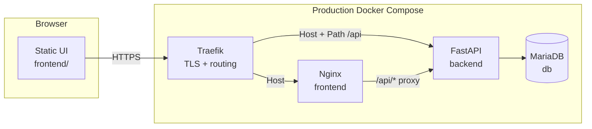

# CSS360 Car Flip

Web application for analyzing car flips: static frontend, FastAPI API, MariaDB in Docker, and in production TLS plus routing through Traefik.

## Table of contents

1. [Architecture](#architecture)
2. [Configuration](#configuration)
3. [Demo catalog and seeds](#demo-catalog-and-seeds)
4. [Local development](#local-development)
5. [CI/CD](#cicd)
6. [Git hooks (pre-commit)](#git-hooks-pre-commit)
7. [Repository guidelines](#repository-guidelines)
8. [Reference: backend layout and API](#reference-backend-layout-and-api)

---

## Architecture

### Overview



| Layer | Technology | Purpose |
|-------|------------|---------|
| **Frontend** | Nginx + static HTML/CSS/JS | Inventory dashboard, filters, login |
| **Backend** | FastAPI (Python 3.11) | REST API, sessions, OAuth, business logic |
| **Database** | MariaDB 10.11 | Users, cars, and related tables |
| **Proxy (prod)** | Traefik | HTTPS, `Host(APP_PUBLIC_HOST)`, strips `/api` prefix for backend |
| **Proxy (local)** | `docker-compose.override.yml` | Publishes ports `8080` / `8000` without Traefik |

Compose is defined in [docker-compose.yml](docker-compose.yml). The internal network `css360_internal` provides DNS between services (`backend`, `db`, `frontend`); the external network `proxy_network` is used by Traefik and for parity with the production stack.

### Request flow

- **Production:** browser → Traefik → paths `/api/*` go to the backend (`StripPrefix(/api)` middleware); everything else goes to Nginx serving static files.
- **Local:** browser → Nginx on `:8080` → `location /api/` proxies to `backend:8000` with the same strip-prefix semantics ([frontend/nginx.conf](frontend/nginx.conf)).

API routes are registered both with and without the `/api` prefix ([backend/app/main.py](backend/app/main.py)) so one codebase works behind Traefik and behind local Nginx.

### Database

- Compose service `db` uses image `mariadb:10.11`; data lives in the named volume `mariadb_data` (survives container restarts).
- Backend connection is configured via `DB_*` or `DATABASE_URL` ([backend/app/config.py](backend/app/config.py)).
- On backend container start, `alembic upgrade head` runs ([backend/entrypoint.sh](backend/entrypoint.sh)).
- Core entity: `cars` table plus satellite tables (location, media, aspects, listing terms, etc.) — see [backend/app/models/](backend/app/models/).
- SSO users are stored in `users` ([backend/app/models/user.py](backend/app/models/user.py)).

Migrations live under [backend/alembic/versions/](backend/alembic/versions/).

### Authentication

**Production** — Microsoft Entra ID (OAuth 2.0 / OpenID Connect):

1. `GET /api/auth/login` — redirect to `login.microsoftonline.com`.
2. `GET /api/auth/callback` — exchange code for tokens, validate `id_token`, upsert user by Azure OID.
3. Session in a signed cookie (`SessionMiddleware`, secret `AUTH_SESSION_SECRET`).
4. Optional `ALLOWED_EMAIL_DOMAIN` — only allow emails like `*@<domain>`.
5. `GET /api/auth/me`, `POST /api/auth/logout` — session check and sign-out.

Implementation: [backend/app/api/routes/auth.py](backend/app/api/routes/auth.py), [backend/app/services/microsoft_oidc.py](backend/app/services/microsoft_oidc.py).

**Local development** — for technical and security reasons, real Microsoft sign-in is **not required**. With `APP_ENV=development` and `DEV_AUTH_BYPASS=true`, the same `/api/auth/login` endpoint creates a local user and session **without** redirecting to Microsoft (fake SSO). In production the bypass is **hard-disabled** (`APP_ENV=production` ignores the flag; enabling bypass in production prevents the app from starting). Entra secrets do not belong in the public repo — see [local development](#local-development).

### Backend (layers)

| Path | Role |
|------|------|
| [backend/app/main.py](backend/app/main.py) | FastAPI app, CORS, sessions, routers |
| [backend/app/config.py](backend/app/config.py) | Environment variables |
| [backend/app/db.py](backend/app/db.py) | SQLAlchemy engine and sessions |
| [backend/app/api/routes/](backend/app/api/routes/) | HTTP: `/cars`, `/health`, `/auth/*` |
| [backend/app/repositories/](backend/app/repositories/) | Database queries |
| [backend/app/services/](backend/app/services/) | ROI, geo, body style, OIDC |
| [backend/app/integrations/ebay/](backend/app/integrations/ebay/) | eBay Browse API (in-memory on main `/cars` when DB empty; not persisted in sandbox) |

### Frontend

Static assets under [frontend/](frontend/). Styles are loaded via [frontend/styles.css](frontend/styles.css) and partials in [frontend/css/](frontend/css/). Icons: [frontend/icons/](frontend/icons/) (MIT, Heroicons).

---

## Configuration

Secrets are **never committed**. For a local machine, copy [.env.example](.env.example) to `.env` (listed in `.gitignore`).

### Environment variables (no secret values)

| Variable | Purpose |
|----------|---------|
| `APP_ENV` | `development` or `production` — app mode and auth checks |
| `DB_HOST`, `DB_PORT`, `DB_NAME`, `DB_USER`, `DB_PASSWORD` | MariaDB connection |
| `MYSQL_ROOT_PASSWORD` | Root password for the `db` container |
| `DEV_AUTH_BYPASS`, `DEV_AUTH_EMAIL` | Non-prod only: fake sign-in |
| `SEED_ON_START`, `PURGE_DEMO_ON_START` | Run seed / demo purge on container start |
| `SEED_WRITE_DEMO_TO_DB` | Explicit write of demo rows to MySQL (see [seeds](#demo-catalog-and-seeds)) |
| `DEMO_IN_MEMORY_WHEN_EMPTY`, `DEMO_SEED_COUNT` | In-memory catalog when `cars` is empty |
| `AZURE_AD_TENANT_ID`, `AZURE_AD_CLIENT_ID`, `AZURE_AD_CLIENT_SECRET` | Entra ID (prod / optional local) |
| `AZURE_AD_REDIRECT_URI` | Must **exactly** match the URI in the Entra app registration |
| `AUTH_SESSION_SECRET` | Session cookie signing |
| `ALLOWED_EMAIL_DOMAIN` | Optional email domain restriction |
| `APP_PUBLIC_HOST` | Hostname for Traefik (no scheme), e.g. `app.example.com` |
| `CORS_ORIGINS` | Required in prod: comma-separated browser origins |
| `EBAY_CLIENT_ID`, `EBAY_CLIENT_SECRET`, `EBAY_SANDBOX` | Optional: live eBay inventory on `/cars` when MySQL has no rows (sandbox listings stay in memory only) |
| `EBAY_DEFAULT_QUERY` | Default eBay search when the UI has no text query (default `car`) |
| `EBAY_CATEGORY_IDS` | eBay category filter (default `6001` = Cars & Trucks) |
| `EBAY_SEARCH_LIMIT` | Max search hits per request (default `24`) |
| `EBAY_GET_ITEM_MAX` | How many hits to enrich via `getItem` (default `10`; `0` = search only) |

Clear all inventory in MySQL (cars + external sellers):

```bash
docker compose exec backend python -m app.purge_inventory
```

One-time on container start: `PURGE_INVENTORY_ON_START=true` in `.env`.

| `INVENTORY_MODE` | `auto` (default), `ebay_only` (no demo fallback), `demo_only` |
| `DEMO_IN_MEMORY_WHEN_EMPTY` | In `auto` mode: demo when DB empty and eBay empty/unconfigured |

`SEED_ON_START=false` only skips writing demo rows **into MySQL**. The UI can still show **in-memory** demo unless `INVENTORY_MODE=ebay_only` (or `DEMO_IN_MEMORY_WHEN_EMPTY=false` in `auto` mode).

Debug after deploy: `GET /api/ebay/health` → `configured`, `inventory_mode`, `in_memory_demo_enabled`.

Use placeholders in docs and examples: `<your-domain>`, `<tenant-id>`, `<secret>`.

### Production: GitHub Actions secrets

Workflow [`.github/workflows/cd.yml`](.github/workflows/cd.yml) deploys on push to `main` over SSH to a VPS and writes a runtime `.env` from secrets:

| Secret | Purpose |
|--------|---------|
| `SSH_HOST`, `SSH_USER`, `SSH_PRIVATE_KEY` | Server access |
| `APP_ENV`, `APP_PUBLIC_HOST` | Mode and hostname |
| `DB_*`, `MYSQL_ROOT_PASSWORD` | Database |
| `SEED_ON_START`, `PURGE_DEMO_ON_START` | Seed / purge on deploy |
| `AZURE_AD_*`, `AUTH_SESSION_SECRET`, `ALLOWED_EMAIL_DOMAIN`, `CORS_ORIGINS` | SSO and CORS |
| `EBAY_CLIENT_ID`, `EBAY_CLIENT_SECRET`, `EBAY_SANDBOX`, `EBAY_DEFAULT_QUERY`, `EBAY_CATEGORY_IDS`, … | eBay Browse API (optional) |
| `INVENTORY_MODE`, `DEMO_IN_MEMORY_WHEN_EMPTY` | `ebay_only` + `false` to test eBay without demo |

### Public repository safety

- Do not commit real passwords, keys, client secrets, or production hostnames (unless intentionally public).
- Store values only in GitHub Actions secrets and server-side `.env`.
- If leaked, rotate `AZURE_AD_CLIENT_SECRET` and `AUTH_SESSION_SECRET`.
- Do not use wildcard `CORS_ORIGINS` in production.
- Never enable `DEV_AUTH_BYPASS` on a public-facing server.

---

## Demo catalog and seeds

Until the database has **real records** from eBay or other sources, the app relies on a **demo data generator** ([backend/app/demo_seed.py](backend/app/demo_seed.py)): a deterministic catalog of ~100 vehicles (default) with locations, media, and attributes.

### No MySQL rows (default)

When the `cars` table is **empty**, `GET /api/cars` and `GET /api/cars/meta` return the same generated catalog **in memory** — nothing is inserted into the database.

| Variable | Default | Meaning |
|----------|---------|---------|
| `DEMO_IN_MEMORY_WHEN_EMPTY` | `true` | In-memory demo when the table is empty |
| `DEMO_SEED_COUNT` | `100` (max `500`) | Number of demo vehicles |

Set `DEMO_IN_MEMORY_WHEN_EMPTY=false` if the API should return an empty list when the database has no rows.

### Writing demo data to the database (optional)

[backend/app/seed.py](backend/app/seed.py) and `SEED_ON_START=true` **write to MySQL only** when `SEED_WRITE_DEMO_TO_DB=1` (rows with `source=demo`). Otherwise the script exits without INSERT.

```bash
docker compose exec backend python -m app.seed
```

To remove demo rows: [backend/app/purge_demo.py](backend/app/purge_demo.py) deletes only `source=demo` (child tables cascade).

```bash
docker compose exec backend python -m app.purge_demo --dry-run
docker compose exec backend python -m app.purge_demo
```

`PURGE_DEMO_ON_START=true` runs purge in [entrypoint.sh](backend/entrypoint.sh) before seed on each container start.

When switching to real data, use purge; do not blindly delete rows with `source=manual` if some of them are already production data.

---

## Local development

For anyone cloning the **public** repository without access to the production `.env` or a Microsoft Entra app registration.

### What you get locally

| URL | Purpose |
|-----|---------|
| http://localhost:8080 | UI + `/api` proxy |
| http://localhost:8000 | Backend directly (Swagger at `/docs`) |

- Demo inventory when `cars` is empty (in-memory).
- **Fake sign-in** with `DEV_AUTH_BYPASS=true` — see [authentication](#authentication).

### Prerequisites

- [Docker Desktop](https://www.docker.com/products/docker-desktop/) (Windows/macOS) or Docker Engine + Compose (Linux)
- Git

### Steps

**1. Clone and `.env`**

```bash
git clone <repository-url>
cd <repo-directory>
cp .env.example .env
```

Ensure these are set (they are in the template by default):

```env
APP_ENV=development
DEV_AUTH_BYPASS=true
DEV_AUTH_EMAIL=dev@localhost
```

You do **not** need `AZURE_AD_*` or `AUTH_SESSION_SECRET` for the bypass.

**2. Network and ports**

```bash
docker network create proxy_network
cp docker-compose.override.example.yml docker-compose.override.yml
```

`docker-compose.override.yml` is gitignored — on Windows/mac it publishes ports. On Ubuntu in production, do **not** use the override — only [docker-compose.yml](docker-compose.yml) and Traefik.

**3. Start the stack**

```bash
docker compose up --build
```

Wait until `db` is healthy and Alembic migrations finish in the `backend` logs.

**4. Sign in (dev bypass)**

1. Open http://localhost:8080/login.html
2. Click **Sign in with Microsoft** — with bypass enabled this hits `/api/auth/login`, creates a local user, and redirects to the inventory **without** a Microsoft prompt.
3. Or open http://localhost:8080/index.html directly — `/api/auth/me` should report you as signed in.

The top bar shows `dev@localhost` (or your `DEV_AUTH_EMAIL`). Sign out via `/api/auth/logout`.

**5. Verify**

- http://localhost:8080/api/health — should return OK
- Vehicle list loads; sidebar filters work (click **Apply** after changing filters)
- http://localhost:8000/docs — OpenAPI UI (development only)

**Optional: persist demo in MariaDB**

```env
SEED_ON_START=true
SEED_WRITE_DEMO_TO_DB=1
```

Then run `docker compose up --build`.

### Without Docker (advanced)

From `backend/` with a venv:

```bash
pip install -r requirements.txt
set APP_ENV=development
set DEV_AUTH_BYPASS=true
# Omit DB_* to use SQLite file cars_dev.db, or point DB_* at local MariaDB
uvicorn app.main:app --reload --port 8000
```

Serve `frontend/` with any static server on port 8080; Compose + Nginx is simpler.

### Real Microsoft sign-in (optional)

1. Set `DEV_AUTH_BYPASS=false`
2. Fill `AZURE_AD_TENANT_ID`, `AZURE_AD_CLIENT_ID`, `AZURE_AD_CLIENT_SECRET`, `AUTH_SESSION_SECRET`
3. Set `AZURE_AD_REDIRECT_URI=http://localhost:8080/api/auth/callback` and add the same URI in Entra → **Authentication** → Redirect URIs

### Troubleshooting

| Problem | Fix |
|---------|-----|
| `network proxy_network not found` | Run `docker network create proxy_network` |
| Login redirects to Microsoft then fails | Confirm `DEV_AUTH_BYPASS=true` in `.env` and restart compose |
| `authentication_is_not_configured` on login | Bypass is off and Azure vars are missing — enable bypass or configure Entra |
| Empty inventory | Check DevTools for `401` on `/api/cars`; confirm session / bypass |
| Port already in use | Change ports in `docker-compose.override.yml` |

---

## CI/CD

### CI — checks on every PR and push to `main`

Workflow [`.github/workflows/ci.yml`](.github/workflows/ci.yml):

| Job | Checks |
|-----|--------|
| **lint** | Ruff (lint + format check), pip-audit, Bandit on `app/` |
| **test** | MariaDB 10.11 service → `alembic upgrade head` → **pytest** |

Locally (from `backend/`):

```bash
cd backend
python -m pip install -r requirements.txt -r requirements-dev.txt
ruff check .
ruff format --check .
pip-audit -r requirements.txt -r requirements-dev.txt
bandit -r app -ll
pytest
```

### CD — deploy on push to `main`

[`.github/workflows/cd.yml`](.github/workflows/cd.yml):

1. Checkout
2. SSH to VPS (`appleboy/ssh-action`)
3. Write `.env` from secrets
4. `docker network create proxy_network` (if missing)
5. `git pull`, `docker compose up -d --build --force-recreate`
6. Smoke-check `GET /health` inside the backend container (up to 10 attempts)

### Dependabot

[`.github/dependabot.yml`](.github/dependabot.yml) opens weekly PRs for **pip** (`backend/`), **GitHub Actions**, and the backend **Docker** image (target branch `dev`).

---

## Git hooks (pre-commit)

Optional: [.pre-commit-config.yaml](.pre-commit-config.yaml) — Ruff (with `--fix`), Ruff format, Bandit, pip-audit.

**One-time setup** (from the **repository root**):

```bash
python -m pip install pre-commit
pre-commit install
```

After `pre-commit install`, hooks run on staged files on every `git commit`; Ruff may **edit** files in place — then `git add` again and commit.

Full tree pass (optional):

```bash
pre-commit run --all-files
```

Hooks run only on machines where `pre-commit install` was executed. The shared gate for everyone is **CI on GitHub**.

---

## Repository guidelines

### Branching and code review

- **Do not push directly to `main`.** Create a feature branch and open a Pull Request.
- **Every PR** requires at least one approval from a teammate.
- Keep CI green (Ruff, pip-audit, Bandit, pytest) before merging.

### Secrets and artifacts

- `.env` and `docker-compose.override.yml` are local only (gitignored).
- Production secrets live only in GitHub Actions secrets and runtime `.env` on the server.
- PRs must not contain passwords, keys, or real redirect URIs with secrets.

### Development style (brief)

- Follow the existing backend/frontend directory layout.
- Database changes only via Alembic in [backend/alembic/](backend/alembic/).
- Prefer small, focused commits; messages should clearly explain *why* the change was made.

---

## Reference: backend layout and API

### `GET /api/cars`

Response: `{ "items": [...], "total": <number> }`. Filters apply to the full result set; the backend sorts, then returns a page.

| Query | Description |
|-------|-------------|
| `limit` | Page size (default **30**, max **50**) |
| `offset` | Starting index (default **0**) |
| `sort_by` | e.g. `roi`, `net_profit`, `price` |
| `sort_order` | `asc` or `desc` |
| `makes` | Repeatable; OR match on make |
| `min_mileage` / `max_mileage` | Mileage bounds |
| `vehicle_titles` | OR match on `vehicle_title` |
| `q` | Search across fields / fuzzy brand+model |
| `radius_mi` + `anchor_lat` / `anchor_lng` | Radius in miles |

The UI loads more pages with **Load more**. `GET /api/cars/meta` exposes slider bounds, makes, `vehicle_titles`, and locations for the filter UI.

### Local Alembic

```bash
cd backend
alembic upgrade head
```
